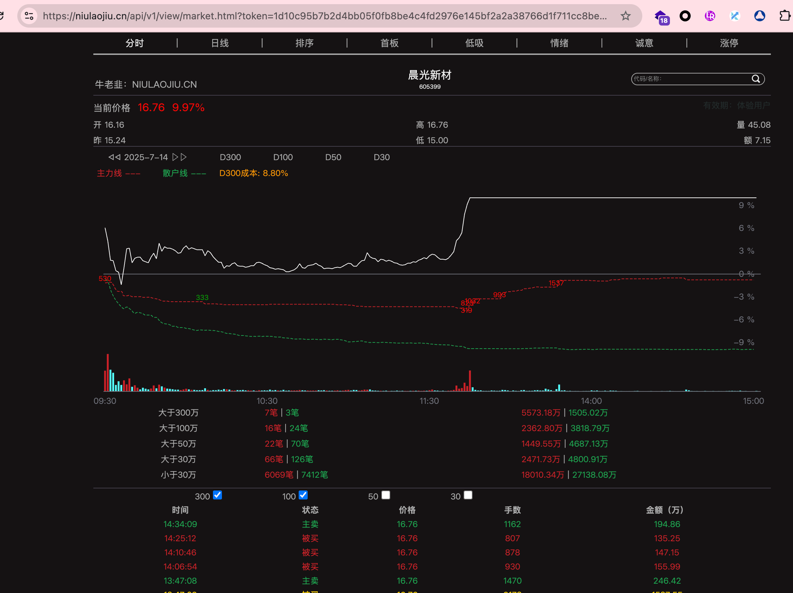

# 🚀 股票大单分析系统

基于实时数据的专业股票分析平台，专注于大单资金流向分析和数据验证。



## ✨ 核心功能

### 📊 实时股票数据展示
- **实时价格监控**: 显示当前价格、涨跌幅、涨跌额等核心指标
- **专业数据指标**: 市盈率、市净率、总市值、流通市值、振幅、量比等
- **行业题材标签**: 显示股票所属行业和主要题材概念
- **市场状态指示**: 实时显示交易状态（交易中/已收盘）

### 📈 分时走势图
- **双线显示**: 白色价格线 + 黄色均价线
- **大单标识**: 实时标记50万以上大单买卖点位
- **成交量柱状图**: 红绿柱状图显示每分钟成交量变化
- **昨收基准线**: 黄色虚线标识昨日收盘价位置
- **交互式图表**: 支持缩放、拖拽，显示详细时间点数据

### 💰 大单资金分析
- **多级别分类**: 
  - D300: 超大单(>300万) - 主力机构
  - D100: 大单(>100万) - 中等资金  
  - D50: 中单(>50万) - 活跃资金
  - D30: 小单(<30万) - 散户资金
- **流向统计**: 净流入金额、买卖占比分析
- **可视化展示**: 饼图显示资金流向分布
- **实时明细**: 显示最新大单交易记录

### 🔍 数据验证系统
- **多源交叉验证**: 整合新浪财经、腾讯股票、efinance等数据源
- **数据质量评分**: 0-100分一致性评分系统
- **价格差异分析**: 实时监控多源数据价格差异
- **验证建议**: 基于数据质量提供使用建议
- **数据源状态**: 显示各数据源活跃状态

### 🎯 智能数据模拟
- **行业特征模拟**: 根据不同行业生成符合特征的数据
- **真实波动模式**: 模拟银行股低波动、科技股高波动等特征
- **合理估值范围**: 基于行业特点生成合理的PE、PB等估值指标

## 🛠️ 技术架构

### 前端技术栈
- **React 18**: 现代化用户界面框架
- **Ant Design 5**: 专业级UI组件库
- **ECharts**: 强大的数据可视化图表库
- **Jotai**: 轻量级状态管理
- **Axios**: HTTP客户端

### 后端技术栈
- **Flask**: 轻量级Python Web框架
- **efinance**: 专业金融数据获取库
- **pandas/numpy**: 数据处理和分析
- **多源数据集成**: 新浪财经、腾讯股票、akshare等

### 系统特性
- **实时数据推送**: 支持实时数据更新
- **多源数据验证**: 确保数据准确性和可靠性
- **专业UI设计**: 仿真专业股票软件界面
- **响应式布局**: 支持多种屏幕尺寸
- **性能优化**: 数据缓存、懒加载等优化策略

## 🚀 快速开始

### 环境要求
- **Python 3.8+**: 后端运行环境
- **Node.js 16+**: 前端运行环境  
- **pnpm**: 包管理器 (可选，推荐)

### 一键启动
```bash
# 克隆项目
git clone <repository-url>
cd NiuNIuNiu

# 给脚本执行权限
chmod +x start.sh stop.sh

# 启动系统
./start.sh
```

### 手动安装

#### 后端启动
```bash
cd backend

# 创建虚拟环境
python3 -m venv venv
source venv/bin/activate

# 安装依赖
pip install -r requirements.txt

# 启动后端服务
python app.py
```

#### 前端启动
```bash
cd frontend

# 安装依赖 (推荐使用pnpm)
pnpm install
# 或使用 npm install

# 启动前端服务
pnpm start
# 或使用 npm start
```

### 访问系统
- **前端地址**: http://localhost:9000
- **后端地址**: http://localhost:9001  
- **健康检查**: http://localhost:9001/health

## 📖 使用说明

### 基本操作
1. **股票查询**: 在搜索框输入6位股票代码（如：000001）
2. **刷新数据**: 点击"刷新"按钮获取最新数据
3. **数据验证**: 点击"验证数据"查看数据质量评估
4. **大单筛选**: 调整过滤金额查看不同级别的大单

### 预置股票
系统预置了以下热门股票数据：
- **000001 平安银行**: 银行业龙头，数字货币概念
- **000002 万科A**: 地产龙头，城市更新概念
- **600036 招商银行**: 零售银行标杆，金融科技
- **600519 贵州茅台**: 白酒龙头，高端消费
- **000858 五粮液**: 浓香型白酒，次高端市场
- **002415 海康威视**: AI视觉龙头，智能安防
- **000725 京东方A**: 面板龙头，柔性屏技术

### 数据说明
- **实时数据**: 交易时间内显示实时价格变动
- **模拟数据**: 非交易时间或数据获取失败时显示模拟数据
- **数据验证**: 通过多源对比确保数据准确性

## 🎨 界面展示

### 主要功能区域
1. **顶部搜索栏**: 股票代码搜索和数据操作
2. **股票信息卡**: 展示股票基本信息和关键指标
3. **分时走势图**: 价格走势和成交量可视化
4. **大单分析**: 资金流向统计和分级展示
5. **交易明细**: 实时和大单交易记录
6. **数据验证**: 数据质量评估和验证结果

### UI特色
- **深色主题**: 专业股票软件风格的深色界面
- **实时数据**: 数据实时更新，支持动态刷新
- **交互体验**: 悬停效果、状态指示、动画过渡
- **响应式设计**: 适配不同屏幕尺寸

## 🔧 系统配置

### 端口配置
- 前端端口: 9000
- 后端端口: 9001

### 数据源配置
系统支持多个数据源，按优先级排序：
1. **efinance**: 主要数据源
2. **新浪财经**: 备用数据源
3. **腾讯股票**: 辅助验证
4. **模拟数据**: 兜底方案

### 缓存策略
- **数据缓存**: 30-60秒缓存周期
- **自动刷新**: 支持定时数据更新
- **错误重试**: 自动重试机制

## 📊 API接口

### 主要接口
- `GET /api/stock/basic?code={code}`: 获取股票基本信息
- `GET /api/stock/timeshare?code={code}`: 获取分时数据
- `GET /api/stock/large-orders?code={code}&min_amount={amount}`: 获取大单数据
- `GET /api/stock/realtime?code={code}`: 获取实时交易数据
- `GET /api/stock/validate?code={code}`: 验证股票数据
- `GET /health`: 系统健康检查

### 接口说明
所有接口返回统一格式：
```json
{
  "code": 200,
  "message": "success", 
  "data": { ... }
}
```

## 🛑 停止系统

```bash
# 停止所有服务
./stop.sh
```

## 📝 日志文件
- **后端日志**: `backend.log`
- **前端日志**: `frontend.log`

## 🤝 贡献指南

1. Fork 本仓库
2. 创建特性分支 (`git checkout -b feature/AmazingFeature`)
3. 提交改动 (`git commit -m 'Add some AmazingFeature'`)
4. 推送到分支 (`git push origin feature/AmazingFeature`)
5. 开启Pull Request

## 📄 许可证

本项目采用 MIT 许可证 - 查看 [LICENSE](LICENSE) 文件了解详情。

## 🎯 未来规划

- [ ] **WebSocket实时推送**: 实现真正的实时数据推送
- [ ] **技术指标扩展**: 添加MACD、KDJ、RSI等技术分析工具
- [ ] **多股票监控**: 支持同时监控多只股票
- [ ] **预警系统**: 大单异动、价格突破预警
- [ ] **历史数据回测**: 支持历史大单数据分析
- [ ] **用户系统**: 支持个人股票池和自定义设置

## 💡 技术亮点

1. **专业级数据验证**: 多源交叉验证确保数据准确性
2. **智能数据模拟**: 基于行业特征的智能数据生成
3. **实时大单追踪**: 专注于资金流向的深度分析
4. **现代化技术栈**: 使用最新的前后端技术
5. **专业UI设计**: 仿真专业股票软件的用户体验

---

**注意**: 本系统仅供学习和研究使用，不构成投资建议。股市有风险，投资需谨慎。 


lsof -ti:9001 | xargs kill -9 2>/dev/null; echo "清理完成"


add